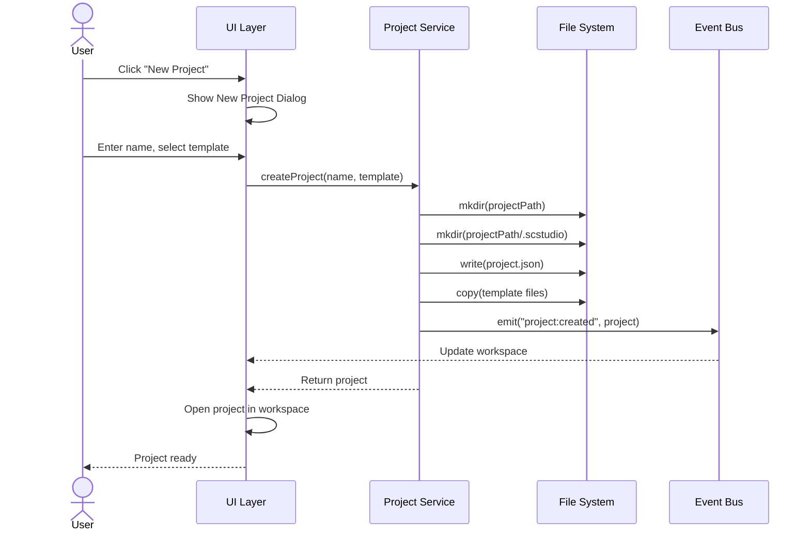
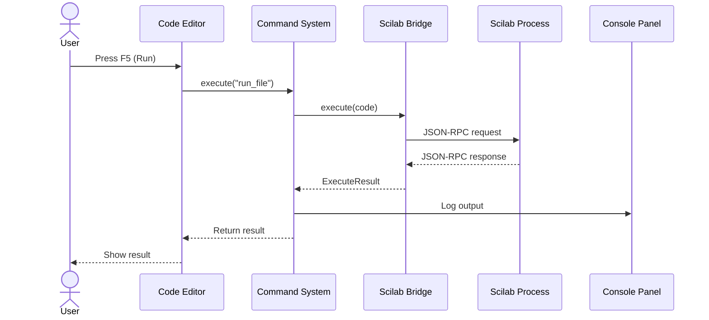
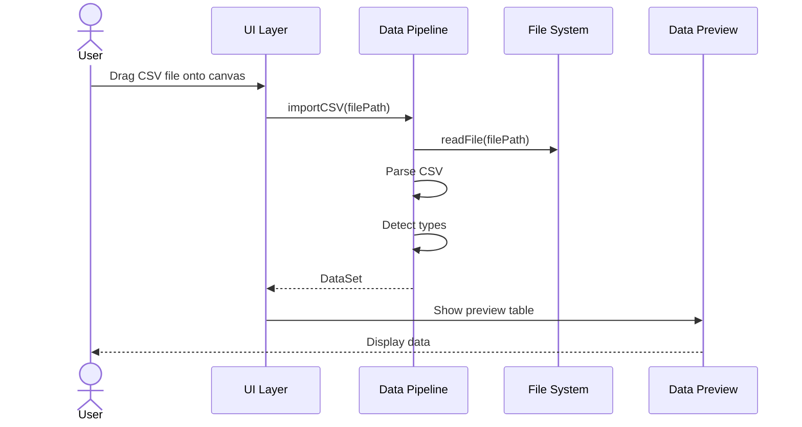
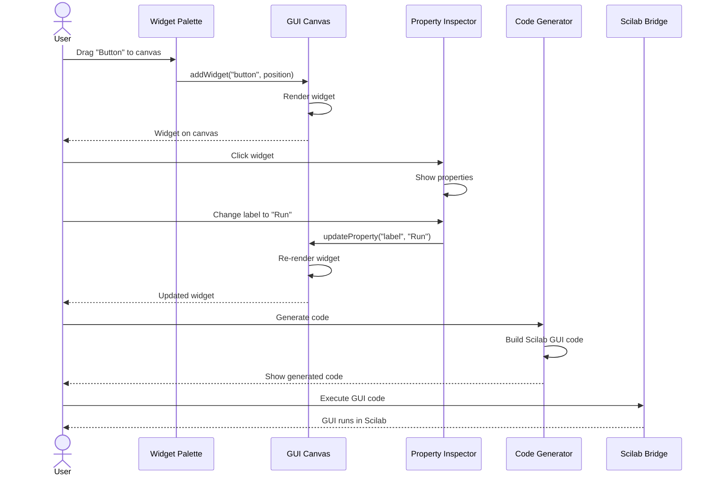
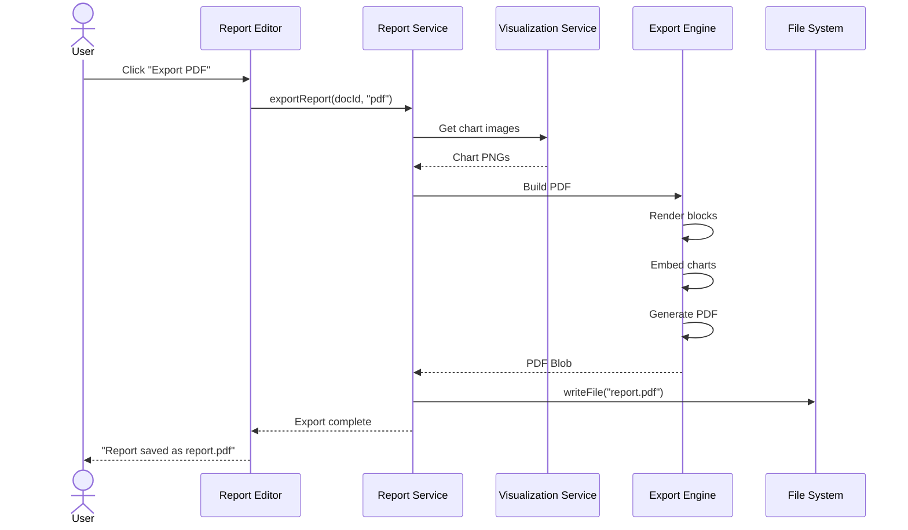
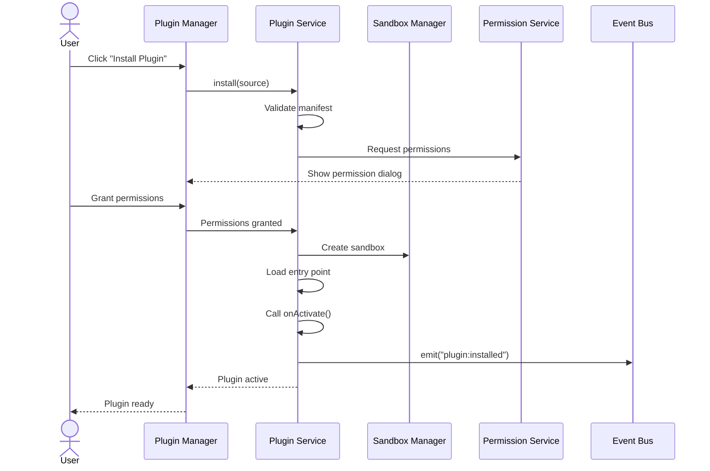

# Sequence Diagrams

## Create Project

```mermaid
sequenceDiagram
    actor User
    participant UI as UI Layer
    participant Proj as Project Service
    participant FS as File System
    participant EvtBus as Event Bus

    User->>UI: Click "New Project"
    UI->>UI: Show New Project Dialog
    User->>UI: Enter name, select template
    UI->>Proj: createProject(name, template)
    Proj->>FS: mkdir(projectPath)
    Proj->>FS: mkdir(projectPath/.scstudio)
    Proj->>FS: write(project.json)
    Proj->>FS: copy(template files)
    Proj->>EvtBus: emit("project:created", project)
    EvtBus-->>UI: Update workspace
    Proj-->>UI: Return project
    UI->>UI: Open project in workspace
    UI-->>User: Project ready
```

## Execute Scilab Command

```mermaid
sequenceDiagram
    actor User
    participant Editor as Code Editor
    participant Cmd as Command System
    participant ScilabSvc as Scilab Bridge
    participant Proc as Scilab Process
    participant Console as Console Panel

    User->>Editor: Press F5 (Run)
    Editor->>Cmd: execute("run_file")
    Cmd->>ScilabSvc: execute(code)
    ScilabSvc->>Proc: JSON-RPC request
    Proc-->>ScilabSvc: JSON-RPC response
    ScilabSvc-->>Cmd: ExecuteResult
    Cmd->>Console: Log output
    Cmd-->>Editor: Return result
    Editor-->>User: Show result
```

## Import CSV

```mermaid
sequenceDiagram
    actor User
    participant UI as UI Layer
    participant DataSvc as Data Pipeline
    participant FS as File System
    participant Preview as Data Preview

    User->>UI: Drag CSV file onto canvas
    UI->>DataSvc: importCSV(filePath)
    DataSvc->>FS: readFile(filePath)
    DataSvc->>DataSvc: Parse CSV
    DataSvc->>DataSvc: Detect types
    DataSvc-->>UI: DataSet
    UI->>Preview: Show preview table
    Preview-->>User: Display data
```

## Create GUI

```mermaid
sequenceDiagram
    actor User
    participant Palette as Widget Palette
    participant Canvas as GUI Canvas
    participant Inspector as Property Inspector
    participant CodeGen as Code Generator
    participant ScilabSvc as Scilab Bridge

    User->>Palette: Drag "Button" to canvas
    Palette->>Canvas: addWidget("button", position)
    Canvas->>Canvas: Render widget
    Canvas-->>User: Widget on canvas

    User->>Inspector: Click widget
    Inspector->>Inspector: Show properties
    User->>Inspector: Change label to "Run"
    Inspector->>Canvas: updateProperty("label", "Run")
    Canvas->>Canvas: Re-render widget
    Canvas-->>User: Updated widget

    User->>CodeGen: Generate code
    CodeGen->>CodeGen: Build Scilab GUI code
    CodeGen-->>User: Show generated code

    User->>ScilabSvc: Execute GUI code
    ScilabSvc-->>User: GUI runs in Scilab
```

## Export Report

```mermaid
sequenceDiagram
    actor User
    participant UI as Report Editor
    participant ReportSvc as Report Service
    participant VizSvc as Visualization Service
    participant Export as Export Engine
    participant FS as File System

    User->>UI: Click "Export PDF"
    UI->>ReportSvc: exportReport(docId, "pdf")
    ReportSvc->>VizSvc: Get chart images
    VizSvc-->>ReportSvc: Chart PNGs
    ReportSvc->>Export: Build PDF
    Export->>Export: Render blocks
    Export->>Export: Embed charts
    Export->>Export: Generate PDF
    Export-->>ReportSvc: PDF Blob
    ReportSvc->>FS: writeFile("report.pdf")
    ReportSvc-->>UI: Export complete
    UI-->>User: "Report saved as report.pdf"
```

## Plugin Installation

```mermaid
sequenceDiagram
    actor User
    participant UI as Plugin Manager
    participant PluginSvc as Plugin Service
    participant Sandbox as Sandbox Manager
    participant PermSvc as Permission Service
    participant EventBus as Event Bus

    User->>UI: Click "Install Plugin"
    UI->>PluginSvc: install(source)
    PluginSvc->>PluginSvc: Validate manifest
    PluginSvc->>PermSvc: Request permissions
    PermSvc-->>UI: Show permission dialog
    User->>UI: Grant permissions
    UI->>PluginSvc: Permissions granted
    PluginSvc->>Sandbox: Create sandbox
    PluginSvc->>PluginSvc: Load entry point
    PluginSvc->>PluginSvc: Call onActivate()
    PluginSvc->>EventBus: emit("plugin:installed")
    PluginSvc-->>UI: Plugin active
    UI-->>User: Plugin ready
```
