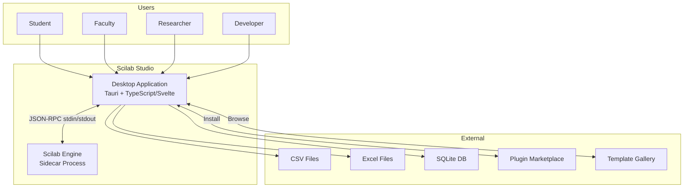
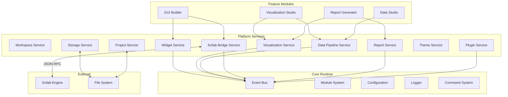
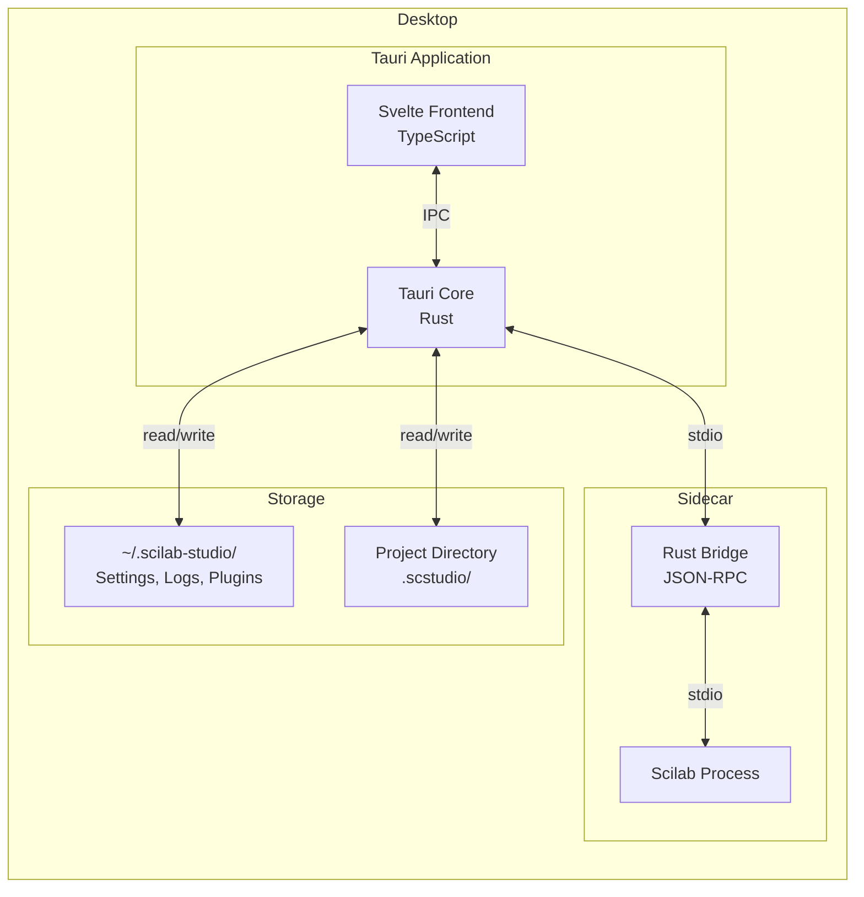
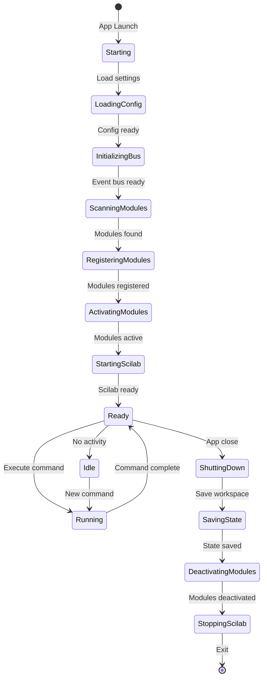
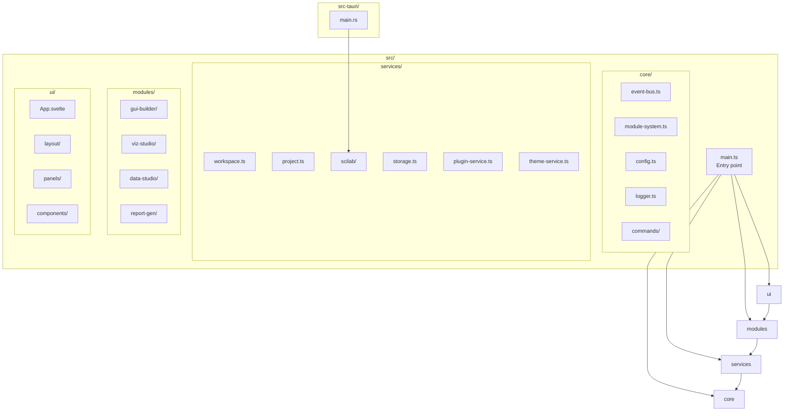
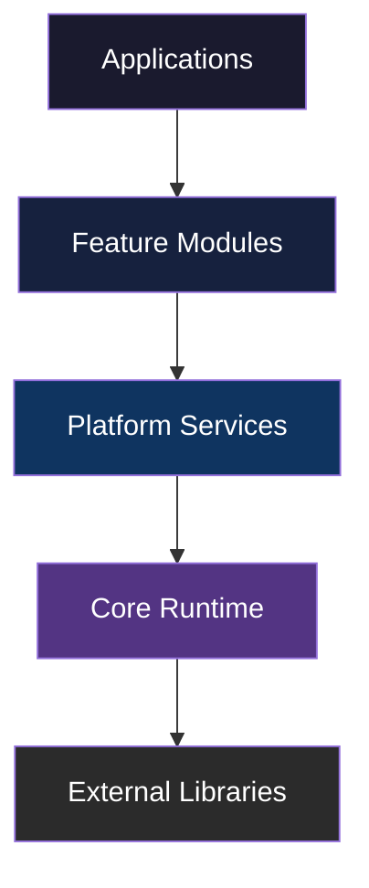

# System Context

```mermaid
graph TB
    subgraph Users
        Student["Student"]
        Faculty["Faculty"]
        Researcher["Researcher"]
        Developer["Developer"]
    end

    subgraph "Scilab Studio"
        App["Desktop Application<br/>Tauri + TypeScript/Svelte"]
        Scilab["Scilab Engine<br/>Sidecar Process"]
    end

    subgraph External
        CSV["CSV Files"]
        Excel["Excel Files"]
        SQLite["SQLite DB"]
        Plugins["Plugin Marketplace"]
        Templates["Template Gallery"]
    end

    Student --> App
    Faculty --> App
    Researcher --> App
    Developer --> App

    App <-->|"JSON-RPC stdin/stdout"| Scilab
    App --> CSV
    App --> Excel
    App --> SQLite
    App <-->|"Install"| Plugins
    App <-->|"Browse"| Templates
```

# Component Diagram

```mermaid
graph TB
    subgraph "Core Runtime"
        EventBus["Event Bus"]
        ModuleSystem["Module System"]
        Config["Configuration"]
        Logger["Logger"]
        CmdSystem["Command System"]
    end

    subgraph "Platform Services"
        WorkspaceSvc["Workspace Service"]
        ProjectSvc["Project Service"]
        WidgetSvc["Widget Service"]
        VizSvc["Visualization Service"]
        DataSvc["Data Pipeline Service"]
        ScilabSvc["Scilab Bridge Service"]
        ReportSvc["Report Service"]
        PluginSvc["Plugin Service"]
        ThemeSvc["Theme Service"]
        StorageSvc["Storage Service"]
    end

    subgraph "Feature Modules"
        GUIBuilder["GUI Builder"]
        VizStudio["Visualization Studio"]
        DataStudio["Data Studio"]
        ReportGen["Report Generator"]
    end

    subgraph External
        Scilab["Scilab Engine"]
        FileSystem["File System"]
    end

    GUIBuilder --> WidgetSvc
    GUIBuilder --> ScilabSvc
    VizStudio --> VizSvc
    VizStudio --> DataSvc
    DataStudio --> DataSvc
    ReportGen --> ReportSvc
    ReportGen --> VizSvc

    WidgetSvc --> EventBus
    VizSvc --> EventBus
    DataSvc --> EventBus
    ScilabSvc --> EventBus
    ReportSvc --> EventBus
    PluginSvc --> EventBus

    ScilabSvc <-->|"JSON-RPC"| Scilab
    StorageSvc <--> FileSystem
    ProjectSvc <--> FileSystem
```

# Deployment Diagram

```mermaid
graph LR
    subgraph "Desktop"
        subgraph "Tauri Application"
            Frontend["Svelte Frontend<br/>TypeScript"]
            TauriCore["Tauri Core<br/>Rust"]
        end

        subgraph "Sidecar"
            ScilabProcess["Scilab Process"]
            RustBridge["Rust Bridge<br/>JSON-RPC"]
        end

        subgraph "Storage"
            AppData["~/.scilab-studio/<br/>Settings, Logs, Plugins"]
            ProjectDir["Project Directory<br/>.scstudio/"]
        end
    end

    Frontend <-->|"IPC"| TauriCore
    TauriCore <-->|"stdio"| RustBridge
    RustBridge <-->|"stdio"| ScilabProcess
    TauriCore <-->|"read/write"| AppData
    TauriCore <-->|"read/write"| ProjectDir
```

# Runtime Lifecycle

```mermaid
stateDiagram-v2
    [*] --> Starting: App Launch
    Starting --> LoadingConfig: Load settings
    LoadingConfig --> InitializingBus: Config ready
    InitializingBus --> ScanningModules: Event bus ready
    ScanningModules --> RegisteringModules: Modules found
    RegisteringModules --> ActivatingModules: Modules registered
    ActivatingModules --> StartingScilab: Modules active
    StartingScilab --> Ready: Scilab ready
    Ready --> Running: Execute command
    Running --> Ready: Command complete
    Ready --> Idle: No activity
    Idle --> Running: New command
    Ready --> ShuttingDown: App close
    ShuttingDown --> SavingState: Save workspace
    SavingState --> DeactivatingModules: State saved
    DeactivatingModules --> StoppingScilab: Modules deactivated
    StoppingScilab --> [*]: Exit
```

# Package Structure

```mermaid
graph TB
    subgraph "src/"
        main["main.ts<br/>Entry point"]
        
        subgraph "core/"
            eventBus["event-bus.ts"]
            moduleSystem["module-system.ts"]
            config["config.ts"]
            logger["logger.ts"]
            commands["commands.ts"]
        end

        subgraph "services/"
            workspace["workspace.ts"]
            project["project.ts"]
            scilab["scilab-bridge.ts"]
            storage["storage.ts"]
            plugins["plugin-service.ts"]
            themes["theme-service.ts"]
        end

        subgraph "modules/"
            guiBuilder["gui-builder/"]
            vizStudio["viz-studio/"]
            dataStudio["data-studio/"]
            reportGen["report-gen/"]
        end

        subgraph "ui/"
            App.svelte["App.svelte"]
            layout["layout/"]
            panels["panels/"]
            components["components/"]
        end
    end

    subgraph "src-tauri/"
        tauriMain["main.rs"]
        commands["commands/"]
        scilab["scilab/"]
    end

    main --> core
    main --> services
    main --> modules
    main --> ui
    services --> core
    modules --> services
    ui --> modules
    tauriMain --> scilab
```

# Dependency Graph

```mermaid
graph TB
    App["Applications"] --> FM["Feature Modules"]
    FM --> PS["Platform Services"]
    PS --> CR["Core Runtime"]
    CR --> Ext["External Libraries"]

    style App fill:#1a1a2e,color:#fff
    style FM fill:#16213e,color:#fff
    style PS fill:#0f3460,color:#fff
    style CR fill:#533483,color:#fff
    style Ext fill:#2b2b2b,color:#fff
```
